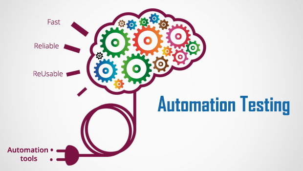

## What Is The Benefit of Test Automation and Why Should We Do It?

Manual software testing is performed by a human sitting in front of a computer carefully going through application screens, trying various usage and input combinations, comparing the results to the expected behavior and recording their observations. Manual tests are repeated often during development cycles for source code changes and other situations like multiple operating environments and hardware configurations.

An automated testing tool is able to playback pre-recorded and predefined actions, compare the results to the expected behavior and report the success or failure of these manual tests to a test engineer. Once automated tests are created they can easily be repeated and they can be extended to perform tasks impossible with manual testing. Because of this, savvy managers have found that automated software testing is an essential component of successful development projects.

### Automated Testing Saves Time and Money
Software tests have to be repeated often during development cycles to ensure quality. Every time source code is modified software tests should be repeated. For each release of the software it may be tested on all supported operating systems and hardware configurations. Manually repeating these tests is costly and time consuming. Once created, automated tests can be run over and over again at no additional cost and they are much faster than manual tests. Automated software testing can reduce the time to run repetitive tests from days to hours. A time savings that translates directly into cost savings

### Vastly Increases Your Test Coverage
Automated software testing can increase the depth and scope of tests to help improve software quality. Lengthy tests that are often avoided during manual testing can be run unattended. They can even be run on multiple computers with different configurations. Automated software testing can look inside an application and see memory contents, data tables, file contents, and internal program states to determine if the product is behaving as expected. Test automation can easily execute thousands of different complex test cases during every test run providing coverage that is impossible with manual tests.

### Testing Improves Accuracy
Even the most conscientious tester will make mistakes during monotonous manual testing. Automated tests perform the same steps precisely every time they are executed and never forget to record detailed results. Testers freed from repetitive manual tests have more time to create new automated software tests and deal with complex features

### Automation Does What Manual Testing Cannot
Even the largest software and QA departments cannot perform a controlled web application test with thousands of users. Automated testing can simulate tens, hundreds or thousands of virtual users interacting with a network, software and web applications.

### Automated Testing Helps Developers and Testers
Shared automated tests can be used by developers to catch problems quickly before sending to QA. Tests can run automatically whenever source code changes are checked in and notify the team or the developer if they fail. Features like these save developers time and increase their confidence.

### QA and Dev Team Morale Improves
This is hard to measure but we’ve experienced it first hand. Executing repetitive tasks with automated software testing gives your team time to spend on more challenging and rewarding projects. Team members improve their skill sets and confidence and, in turn, pass those gains on to their organization.

#### There are several different types of software tests that can be automated:

1. [Unit Testing](https://smartbear.com/learn/automated-testing/what-is-unit-testing/)
2. [Integration Testing](https://smartbear.com/learn/automated-testing/what-is-integration-testing/)
3. [Functional Testing](https://smartbear.com/solutions/functional-testing/)
4. [Regression Testing](https://smartbear.com/learn/automated-testing/what-is-regression-testing/)
5. [Keyword Testing](https://smartbear.com/learn/automated-testing/benefits-of-keyword-testing/)
6. [Data Driven Testing](https://smartbear.com/learn/automated-testing/introduction-to-data-driven-testing/)
7. [Smoke Testing](https://support.smartbear.com/readyapi/docs/performance/configure/new/templates/smoke.html?_ga=2.177294124.806472957.1612812440-886064685.1612812440)
