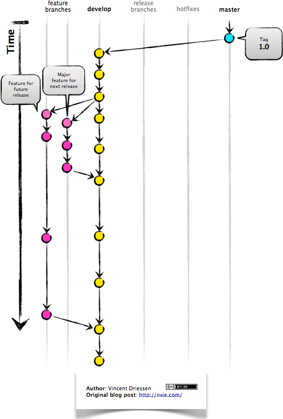

# **Explanation of GitFlow**
GitFlow is a branching model for Git, created by Vincent Driessen. It has attracted a lot of attention because it is very well suited to collaboration and scaling the development team.

## How GitFlow works:
1.	New development (new features, non-emergency bug fixes) are built in feature branches:

2.	Feature branches are branched off of the develop branch, and finished features and fixes are merged back into the develop branch when they’re ready for release:

3.	When it is time to make a release, a release branch is created off of develop:

4.	The code in the release branch is deployed onto a suitable test environment, tested, and any problems are fixed directly in the release branch. This deploy -> test -> fix -> redeploy -> retest cycle continues until you’re happy that the release is good enough to release to customers.
When the release is finished, the release branch is merged into master and into develop too, to make sure that any changes made in the release branch aren’t accidentally lost by new development.

5.	The master branch tracks released code only. The only commits to master are merges from release branches and hotfix branches.
Hotfix branches are used to create emergency fixes:

6.	They are branched directly from a tagged release in the master branch, and when finished are merged back into both master and develop to make sure that the hotfix isn’t accidentally lost when the next regular release occurs.
